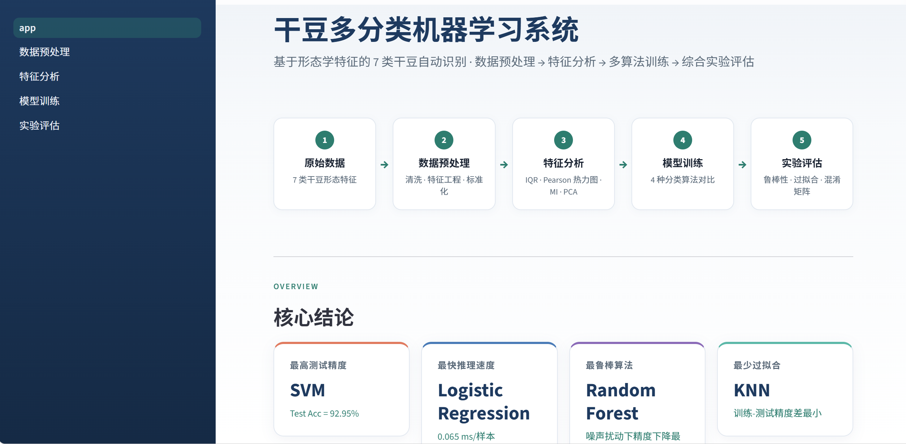
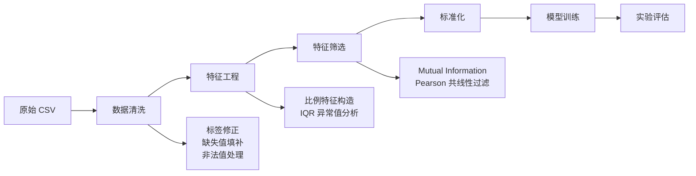
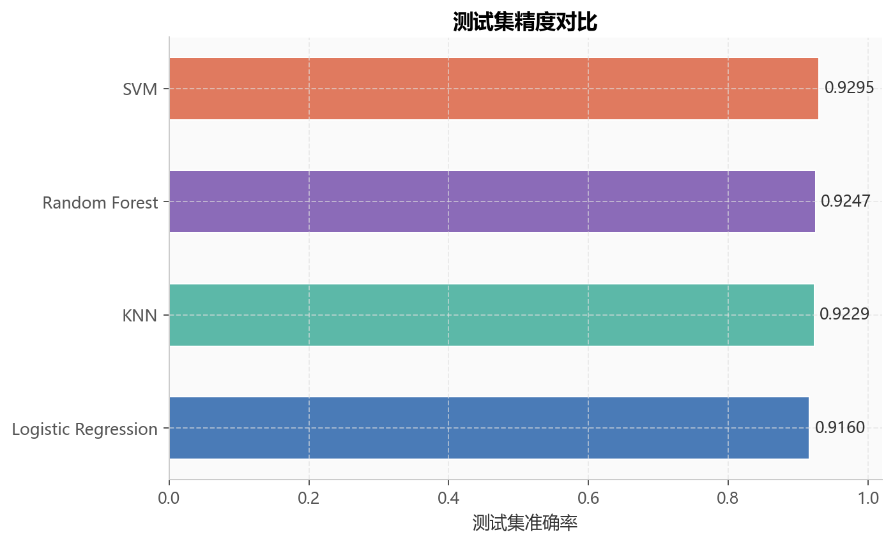
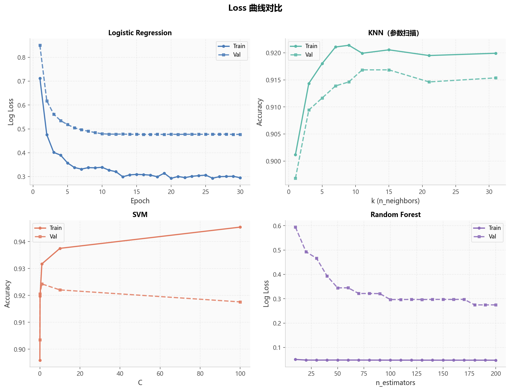
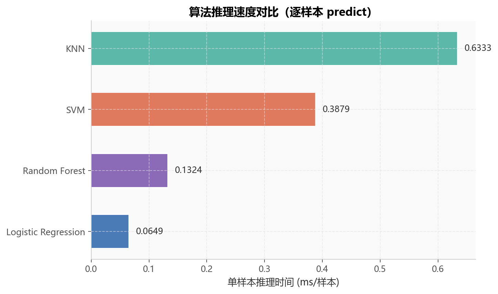
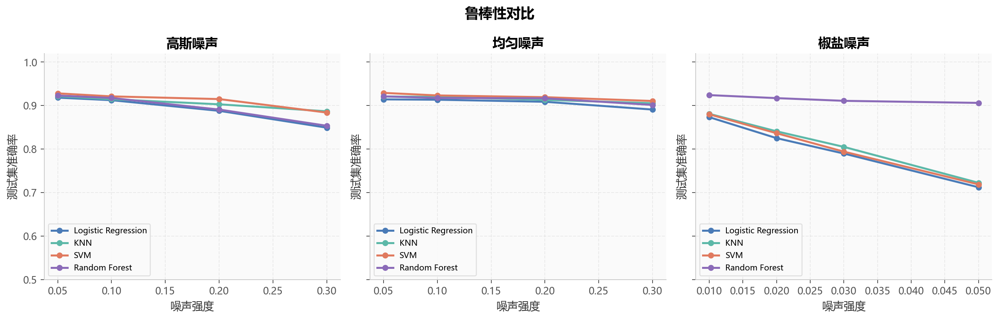
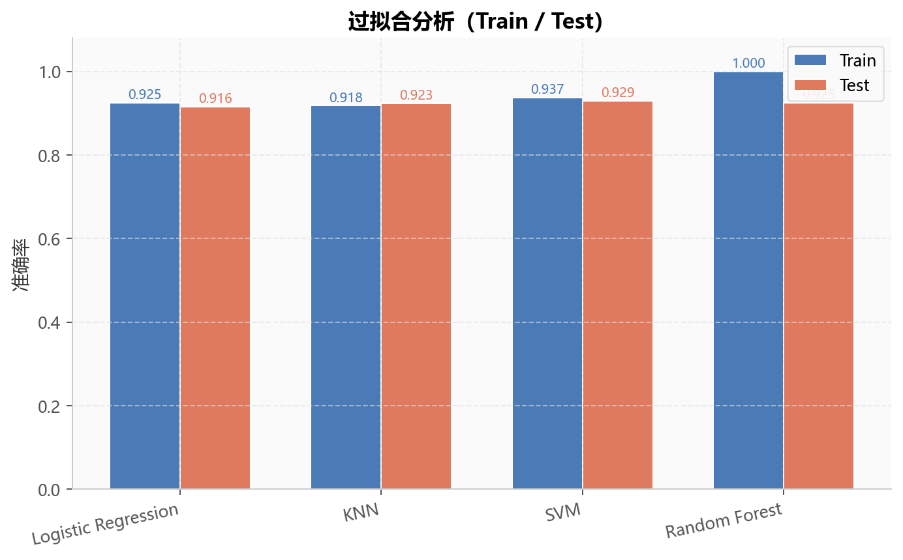
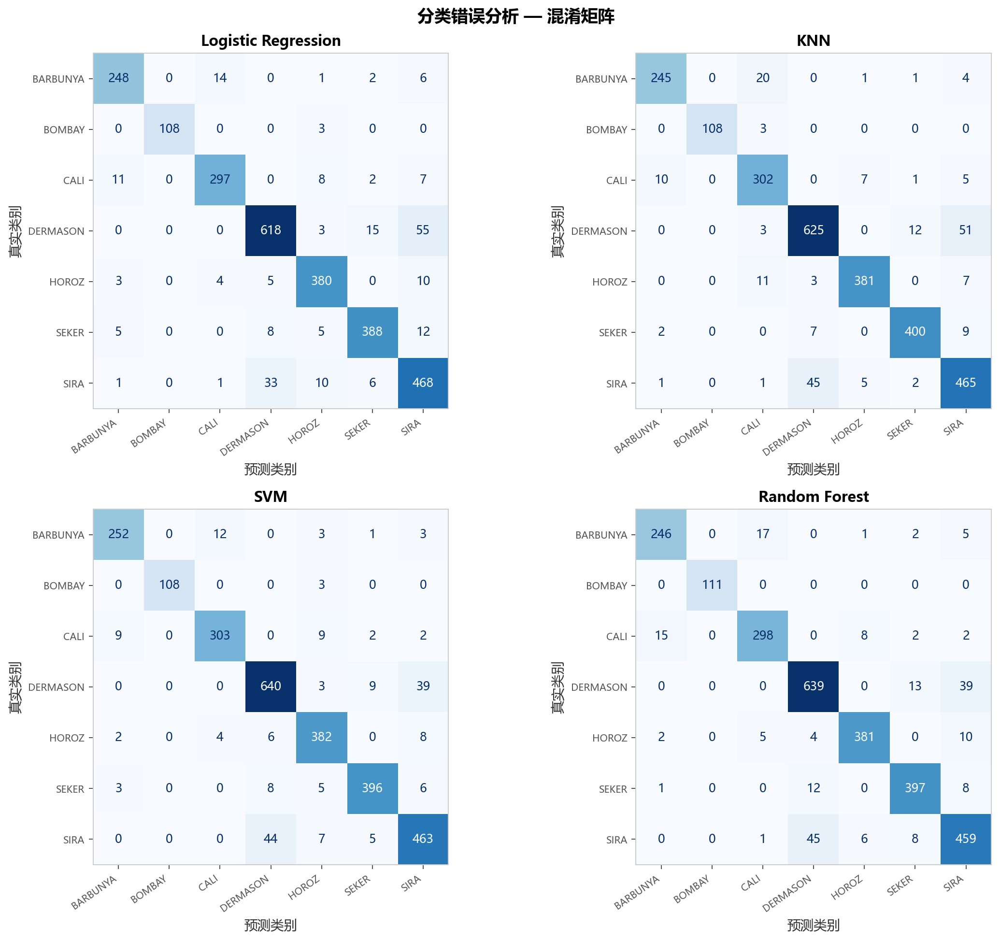
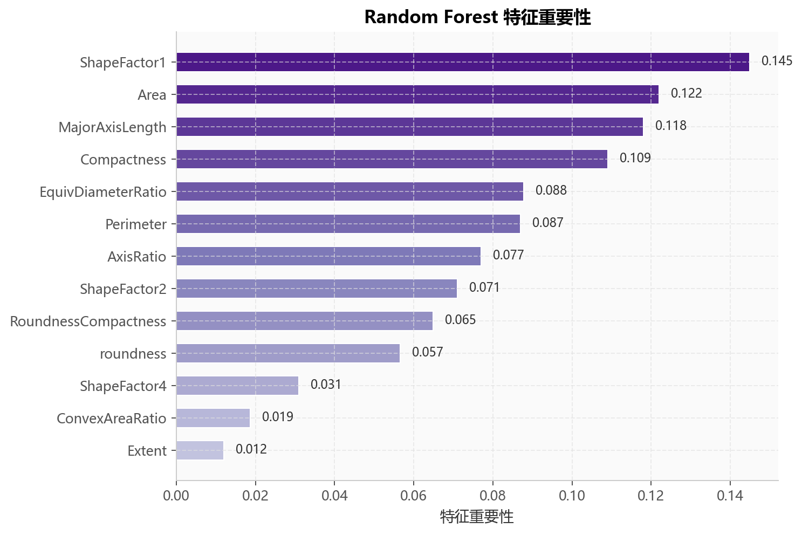

# 🫘 干豆多分类机器学习系统

> 基于形态学特征的 **7 类干豆自动识别系统**
> 数据预处理 → 特征分析 → 多算法训练 → 综合实验评估 → Streamlit 可视化展示

[](https://www.python.org/)
[](https://scikit-learn.org/)
[](https://streamlit.io/)
[](https://github.com/Zhuoran-Cai/dry-bean-ml)

---

## 📖 目录

* [项目简介](#项目简介)
* [展示界面](#展示界面)
* [数据集描述](#数据集描述)
* [数据处理流程](#数据处理流程)
* [算法实现](#算法实现)
* [模型精度对比](#模型精度对比)
* [实验结果可视化](#实验结果可视化)
* [实验结论](#实验结论)
* [项目结构](#项目结构)
* [快速开始](#快速开始)
* [引用与致谢](#引用与致谢)

---

<a id="项目简介"></a>

## ✨ 项目简介

本项目面向 **Dry Bean Dataset 干豆多分类任务**，构建了一套从原始 CSV 数据到机器学习建模与可视化展示的完整工程流程。系统首先对带有 OCR 误识别、缺失值、非法字符和异常值的脏数据进行清洗，然后进行特征工程、特征筛选、模型训练和综合实验评估，最后通过 **Streamlit** 搭建可视化展示界面。

本项目实现了 **4 种多分类算法**：

* **Logistic Regression**
* **KNN**
* **SVM**
* **Random Forest**

系统从测试集准确率、训练/测试精度差异、推理速度、噪声鲁棒性、混淆矩阵和特征重要性等多个角度对模型进行比较分析，适合作为机器学习课程期末项目展示。

**核心亮点：**

| 模块    | 实现内容                                                  |
| ----- | ----------------------------------------------------- |
| 数据清洗  | 标签 OCR 修正、非法字符处理、缺失值填补、重复样本删除                         |
| 特征工程  | 构造形态比例特征，使用 Mutual Information 与共线性过滤进行特征筛选           |
| 多算法实验 | Logistic Regression、KNN、SVM、Random Forest 四种模型统一训练与评估 |
| 综合评估  | 准确率、推理速度、过拟合分析、鲁棒性实验、混淆矩阵、特征重要性                       |
| 工程展示  | Streamlit 多页面仪表盘 + GitHub README + 命令行统一调用            |

---

<a id="展示界面"></a>

## 🖥️ 展示界面

启动 Streamlit 后，系统提供 **5 个页面**，覆盖项目完整流程：

| 页面        | 内容                              |
| --------- | ------------------------------- |
| **项目概览**  | 核心 KPI、数据集概况、项目流程导航             |
| **数据预处理** | 清洗流程、类别分布、特征列表、预处理摘要            |
| **特征分析**  | IQR 箱线图、特征共线性分析、MI 排名、PCA 二维可视化 |
| **模型训练**  | 四种算法准确率对比、训练曲线与参数敏感性分析          |
| **实验评估**  | 推理速度、噪声鲁棒性、过拟合分析、混淆矩阵、特征重要性     |

```bash
# Windows 一键启动
run_ui.bat

# 或使用通用命令
streamlit run app.py --server.port 8505
```

### 界面预览

下图展示了 Streamlit 系统的主界面，包括侧边栏导航、项目流程卡片、核心结论和模型表现摘要。

<p align="center">
  
</p>

---

<a id="数据集描述"></a>

## 📊 数据集描述

本项目使用 **Dry Bean Dataset（Dirty 版本）**。该数据集在标准 UCI 干豆数据集基础上加入了标签 OCR 误识别、缺失值、非法字符和异常值等问题，更接近真实机器学习项目中的脏数据场景。

| 属性       | 说明           |
| -------- | ------------ |
| **任务类型** | 7 分类多分类任务    |
| **样本总量** | 13,587 条样本   |
| **训练集**  | 9,503 条样本    |
| **验证集**  | 1,347 条样本    |
| **测试集**  | 2,737 条样本    |
| **原始特征** | 16 个形态学特征    |
| **工程特征** | 5 个比值 / 组合特征 |
| **最终特征** | 13 维有效特征     |
| **类别标签** | 7 类干豆品种      |

**7 个类别：**

`BARBUNYA` · `BOMBAY` · `CALI` · `DERMASON` · `HOROZ` · `SEKER` · `SIRA`

**原始特征示例：**

Area, Perimeter, MajorAxisLength, MinorAxisLength, AspectRation, Eccentricity, ConvexArea, EquivDiameter, Extent, Solidity, roundness, Compactness, ShapeFactor1, ShapeFactor2, ShapeFactor3, ShapeFactor4

---

<a id="数据处理流程"></a>

## 🔧 数据处理流程

本项目的数据处理流程包括标签修正、数值清洗、缺失值处理、特征工程、异常值分析、特征筛选、共线性过滤、标准化和 PCA 可视化。



| 模块           | 方法                 | 说明                                                      |
| ------------ | ------------------ | ------------------------------------------------------- |
| Label        | OCR 替换             | `0→O`、`3→E`，统一大写并过滤非法类别                                 |
| Clean        | 正则 + 类型转换          | 去除 `"?"`、空字符串，剥离 `"cm"` 等单位后缀                           |
| Missing      | `SimpleImputer`    | 使用训练集中位数填补，避免数据泄漏                                       |
| Feature      | 比值特征构造             | 构造 AxisRatio、AreaPerimeterRatio、ConvexAreaRatio 等形态比例特征 |
| Outlier      | IQR × 1.5          | 使用箱线图识别离群点，默认不直接删除                                      |
| Selection    | Mutual Information | 保留对多分类任务贡献较高的特征                                         |
| Collinearity | Pearson 相关系数       | 剔除 `\|r\| > 0.95` 的高度冗余特征对                              |
| Scaling      | `StandardScaler`   | 仅在训练集 fit，并同步转换验证集与测试集                                  |
| PCA          | PCA n=2            | 用于特征分析页面的二维散点图展示                                        |

**最终保留的 13 个特征：**

`Area` · `Perimeter` · `MajorAxisLength` · `Extent` · `roundness` · `Compactness` · `ShapeFactor1` · `ShapeFactor2` · `ShapeFactor4` · `AxisRatio` · `ConvexAreaRatio` · `EquivDiameterRatio` · `RoundnessCompactness`

---

<a id="算法实现"></a>

## 🤖 算法实现

系统实现了 **4 种多分类算法**，并采用统一训练、评估和保存接口：

| 算法                      | 类型   | 关键设置                         | 分析内容                |
| ----------------------- | ---- | ---------------------------- | ------------------- |
| **Logistic Regression** | 线性模型 | `C=1.0`, `solver=lbfgs`      | 训练 / 验证 Log Loss 曲线 |
| **KNN**                 | 距离模型 | `k=5`, `weights=distance`    | 不同 k 值下的准确率变化       |
| **SVM**                 | 核方法  | RBF 核, `C=10`, `gamma=scale` | 不同 C 参数下的准确率变化      |
| **Random Forest**       | 集成学习 | 200 棵树, 不限制最大深度              | 随树数量增加的 Log Loss 变化 |

**扩展实验：**

| 实验    | 内容                                      |
| ----- | --------------------------------------- |
| 推理速度  | 统计各模型单样本平均预测时间                          |
| 鲁棒性实验 | 向标准化后的测试集注入高斯、均匀、椒盐噪声                   |
| 过拟合分析 | 对比训练集和测试集准确率差异                          |
| 混淆矩阵  | 分析不同类别之间的误分类情况                          |
| 特征重要性 | 基于 Random Forest Gini Importance 展示关键特征 |

---

<a id="模型精度对比"></a>

## 📈 模型精度对比

以下结果为当前流水线完整运行后在独立测试集上的模型表现。

### 综合精度表

|            算法           |   训练精度  |  验证精度  |    测试精度    | 过拟合间隙 ↓ |      推理耗时 ↓      |
| :---------------------: | :-----: | :----: | :--------: | :-----: | :--------------: |
|         **SVM**         |  93.75% | 92.20% | **92.95%** |  0.80%  |    0.163 ms/样本   |
|    **Random Forest**    | 100.00% | 92.06% |   92.47%   |  7.53%  |    0.023 ms/样本   |
|         **KNN**         | 100.00% | 91.17% |   92.29%   |  7.71%  |    0.035 ms/样本   |
| **Logistic Regression** |  92.46% | 91.76% |   91.60%   |  0.86%  | **0.0001 ms/样本** |

> 说明：过拟合间隙 = 训练精度 − 测试精度。Random Forest 和 KNN 在训练集上达到 100%，说明二者对训练集拟合较强；SVM 在测试集上取得最高准确率，整体泛化表现较好。

### 指标解读

| 维度    | 最优算法                          | 结论                     |
| ----- | ----------------------------- | ---------------------- |
| 测试精度  | **SVM**                       | RBF 核 SVM 在测试集上取得最高准确率 |
| 推理速度  | **Logistic Regression**       | 线性模型计算量最低，预测速度最快       |
| 噪声鲁棒性 | **Random Forest**             | 在多种噪声扰动下整体表现更稳定        |
| 泛化稳定性 | **SVM / Logistic Regression** | 训练集与测试集差距较小，过拟合程度较低    |

---

<a id="实验结果可视化"></a>

## 📊 实验结果可视化

本节集中展示模型实验中生成的主要结果图，每张图对应一个评估维度。

### 1. 算法准确率对比

该图展示四种多分类算法在测试集上的准确率表现，其中 SVM 取得最高测试精度。

<p align="center">
  
</p>

### 2. 训练曲线与参数敏感性分析

该图展示 Logistic Regression 的损失变化，以及 KNN、SVM、Random Forest 在不同参数设置下的表现变化，用于观察模型训练稳定性和参数影响。

<p align="center">
  
</p>

### 3. 推理速度对比

该图比较四种算法的单样本平均推理耗时，用于分析不同模型在实际部署中的预测效率。

<p align="center">
  
</p>

### 4. 噪声鲁棒性实验

该图展示模型在高斯噪声、均匀噪声和椒盐噪声扰动下的测试精度变化，用于评估模型对数据扰动的稳定性。

<p align="center">
  
</p>

### 5. 过拟合分析

该图比较不同模型在训练集与测试集上的准确率差异，用于判断模型是否存在明显过拟合。

<p align="center">
  
</p>

### 6. 混淆矩阵

该图展示模型对 7 个干豆类别的分类结果，可用于观察哪些类别之间更容易发生混淆。

<p align="center">
  
</p>

### 7. Random Forest 特征重要性

该图展示 Random Forest 模型判断出的关键特征，有助于解释哪些形态学特征对分类结果影响更大。

<p align="center">
  
</p>

---

<a id="实验结论"></a>

## 🏆 实验结论

1. **SVM** 在测试集上取得最高准确率，说明 RBF 核方法能够较好地处理干豆形态特征中的非线性分类边界。
2. **Logistic Regression** 推理速度最快，虽然准确率略低于 SVM 和 Random Forest，但适合对实时预测速度要求较高的场景。
3. **Random Forest** 在训练集上达到 100% 准确率，存在一定过拟合倾向，但在噪声鲁棒性实验中表现最稳定。
4. **KNN** 在测试集上取得较好表现，但由于预测阶段需要计算样本之间的距离，推理速度慢于线性模型。
5. 鲁棒性实验表明，不同类型噪声对模型影响不同，其中椒盐噪声破坏性更强，而 Random Forest 对该类扰动的稳定性相对更好。

---

<a id="项目结构"></a>

## 📁 项目结构

```text
dry-bean-ml/
├── app.py                  # Streamlit 展示入口
├── main.py                 # 命令行统一入口
├── run_ui.bat              # Windows 一键启动展示界面
├── requirements.txt        # Python 依赖
├── config/
│   ├── preprocess.yaml     # 数据预处理配置
│   └── train.yaml          # 模型训练配置
├── data/                   # 原始数据集
├── prep/                   # 数据加载与预处理模块
├── src/                    # 算法、画图、推理计时相关代码
├── train_eval/             # 训练与评估流水线
├── pages/                  # Streamlit 子页面
├── ui/                     # 展示界面组件与样式
├── models/trained/         # 训练好的模型文件
└── results/
    ├── processed/          # 预处理后数据
    ├── experiments/        # 实验结果 CSV
    └── figures/            # 实验图表与界面截图
```

---

<a id="快速开始"></a>

## 🚀 快速开始

### 1. 克隆仓库

```bash
git clone https://github.com/Zhuoran-Cai/dry-bean-ml.git
cd dry-bean-ml
```

### 2. 安装依赖

```bash
pip install -r requirements.txt
```

### 3. 运行完整流水线

```bash
python main.py --task all
```

也可以分步执行：

```bash
python main.py --task preprocess   # 数据预处理
python main.py --task analyze      # 特征分析
python main.py --task train        # 训练四种算法
python main.py --task evaluate     # 测试集评估与图表生成
```

### 4. 启动展示界面

```bash
streamlit run app.py --server.port 8505
```

---

<a id="引用与致谢"></a>

## 📎 引用与致谢

* 数据集基于 [UCI Dry Bean Dataset](https://archive.ics.uci.edu/ml/datasets/Dry+Bean+Dataset)
* 本项目用于「机器学习与项目实践」课程期末大作业展示
* 项目内容涵盖数据预处理、特征工程、多分类算法对比、鲁棒性实验和可视化系统设计

---
